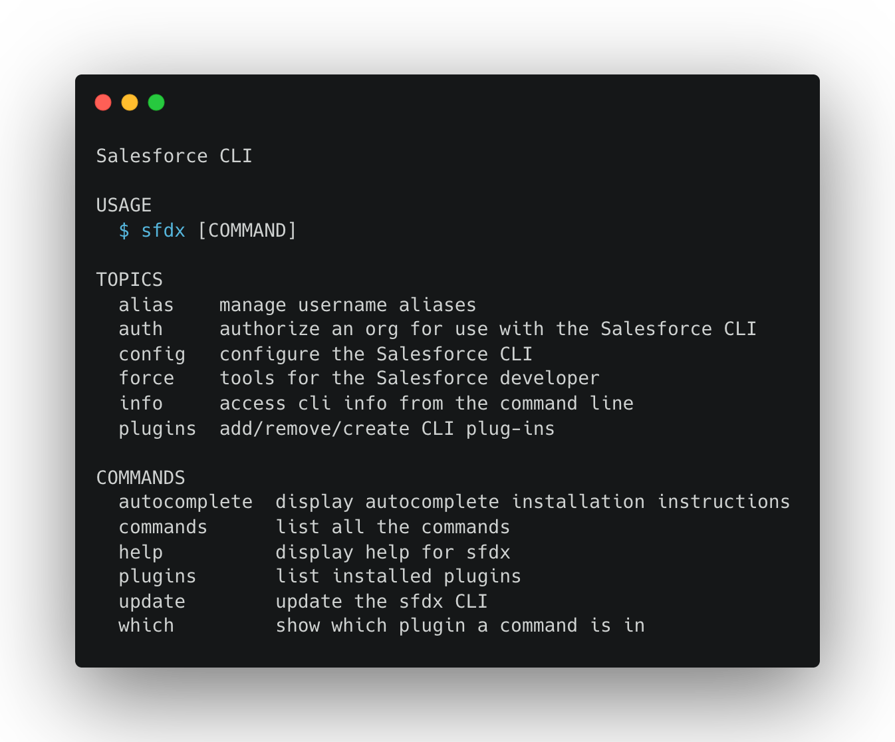

# Heroku Buildpack for Salesforce CLI



This is a [Heroku Buildpack](http://devcenter.heroku.com/articles/buildpacks) to install the [Salesforce CLI](https://developer.salesforce.com/tools/sfdxcli).

Both the `sfdx` and `sf` executables are installed. See [Salesforce CLI Unification](https://developer.salesforce.com/docs/atlas.en-us.sfdx_setup.meta/sfdx_setup/sfdx_setup_sf_intro.htm) for differences between them.

## Usage

### Using the Heroku Salesforce buildpack

```shell
heroku buildpacks:set https://github.com/douglascayers/heroku-salesforce-cli-buildpack#latest -a my-app
```

### Locking to a buildpack version

For stability reasons, you may want to lock dependencies - including buildpacks - to a specific version.

First, find the version you want from
[the list of buildpack versions](https://github.com/douglascayers/heroku-salesforce-cli-buildpack/releases).
Then, specify that version with `buildpacks:set` by appending the version tag to the url:

```shell
heroku buildpacks:set https://github.com/douglascayers/heroku-salesforce-cli-buildpack#v1 -a my-app
```

### Chain with multiple buildpacks

The buildpack automatically exports the cli binary onto the `$PATH` for easy use in subsequent buildpacks.

### Configuration Variables

By default, the buildpack will install the latest Salesforce CLI version from the [stable](https://developer.salesforce.com/docs/atlas.en-us.sfdx_setup.meta/sfdx_setup/sfdx_setup_install_cli.htm) channel.

The buildpack automatically infers the operating system and machine architecture of the Heroku dyno
to know which binary to install. However, you may set the following configuration variables to use specific values.

| Variable                 | Sample Value | Default    | Description                                      |
| ------------------------ | ------------ | ---------- | ------------------------------------------------ |
| SALESFORCE_CLI_VERSION   | v7.152.0     | latest     | Which version to download.                       |
| SALESFORCE_CLI_OS        | linux, macos | (inferred) | Which operating system you're installing on.     |
| SALESFORCE_CLI_ARCH      | x64, arm64   | (inferred) | Which CPU architecture you're installing on.     |

Salesforce recommends that you always use the latest version or release candidate of Salesforce CLI. However, you can set `SALESFORCE_CLI_VERSION` if you need to pin your app to a [specific version](https://developer.salesforce.com/docs/atlas.en-us.sfdx_setup.meta/sfdx_setup/sfdx_setup_install_cli.htm#sfdx_setup_install_cli_olderversions).

## Example Build Log

```
-----> Salesforce app detected
-----> Creating runtime environment

       SALESFORCE_CLI_VERSION=7.152.0
       SALESFORCE_CLI_OS=darwin
       SALESFORCE_CLI_ARCH=x64

-----> Downloading Salesforce CLI

       https://developer.salesforce.com/media/salesforce-cli/sfdx/versions/7.152.0/3054818/sfdx-v7.152.0-3054818-darwin-x64.tar.gz

-----> Installing Salesforce CLI

       sfdx-cli/7.151.1 darwin-x64 node-v16.15.0
       @salesforce/cli/1.28.0 darwin-x64 node-v16.15.0

-----> Successfully installed Salesforce CLI
```

## Development

* Install [shell-format](https://marketplace.visualstudio.com/items?itemName=foxundermoon.shell-format) Visual Studio Code extension
* Add the following to your `settings.json`
   ```json
    "shellformat.flag": "-i 2 -ci -bn -sr",
    "shellformat.effectLanguages": [
       "shellscript",
       "dockerfile",
       "dotenv",
       "hosts",
       "ignore",
       "gitignore",
       "properties",
    ]
    ```
